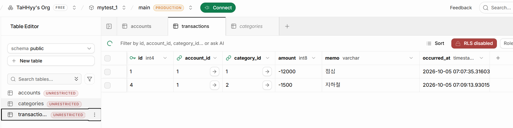
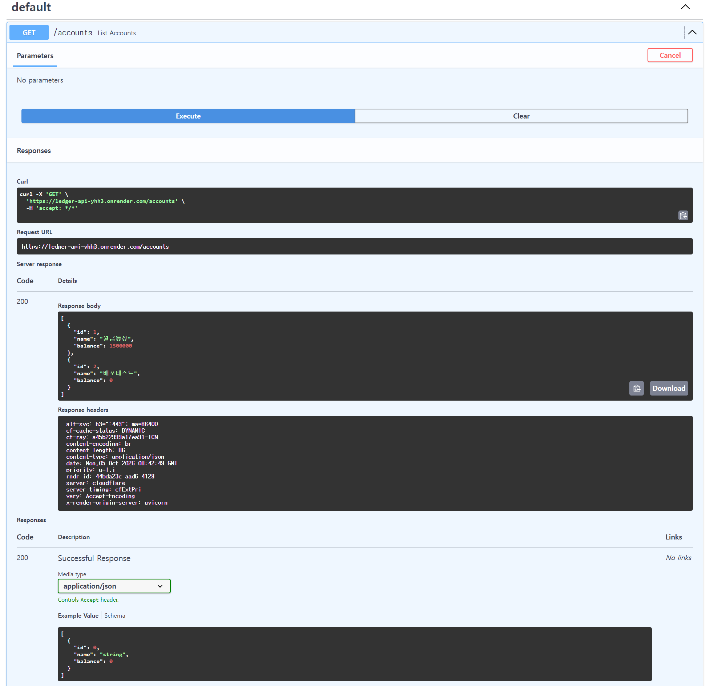
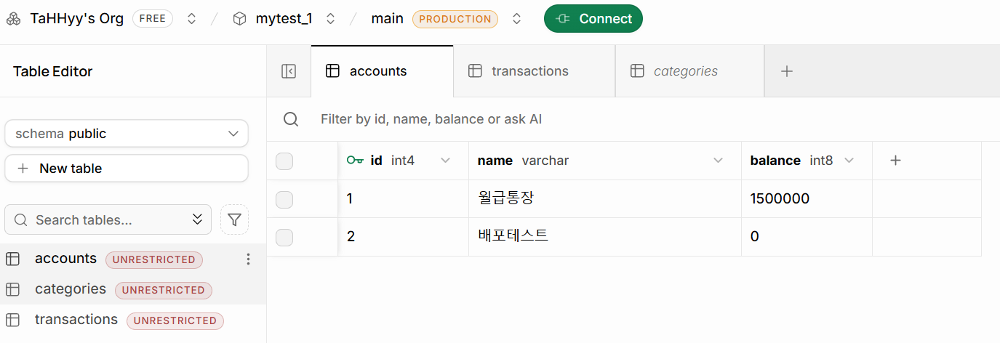

# ledger-api

- GitHub: https://github.com/TaHHyy/ledger-api
- Render: https://ledger-api-yhh3.onrender.com

FastAPI + SQLAlchemy + Supabase(PostgreSQL)로 만든 가계부 API. 
계좌·거래·카테고리 CRUD, 계좌별 거래 중첩 조회, 카테고리별 지출 통계를 제공한다.

- 로컬 실행: `uvicorn main:app --reload`
- 배포: Render 환경변수 `DATABASE_URL`로 Supabase에 연결
- 참고: 무료 플랜이라 한동안 접속이 없으면 첫 요청에 약 1분 걸릴 수 있다.

# 실습 기록

## ① 결과 확인

**Supabase Table Editor - transactions** (거래 데이터가 DB에 저장됨)

**Render 배포 주소 /docs - GET /accounts** (인터넷 주소의 API가 Supabase의 계좌를 조회함)

**Supabase Table Editor - accounts** (Render의 /docs에서 POST로 만든 `배포테스트` 계좌가 DB에 남아 있음)

## ② 핵심 개념 되새김

1. **계좌와 거래를 두 테이블로 나눈 이유 (1:N)**: 한 계좌에는 거래가 여러 건 생긴다. 한 표에 합치면 계좌 이름이 거래마다 반복되어 수정이 어렵다. 그래서 `accounts`(1)와 `transactions`(N)로 나누고, 거래가 `account_id`로 계좌의 `id`를 가리키게(외래키) 했다. DB가 존재하지 않는 계좌를 가리키는 거래를 거부해 데이터 일관성도 지켜진다.
2. **SQLAlchemy 모델 클래스와 실제 테이블의 대응**: 클래스(`Account`)는 테이블(`accounts`), 클래스 속성(`mapped_column`)은 컬럼, 객체 하나는 행 한 줄에 대응한다. `Base.metadata.create_all`이 클래스 정의를 읽어 `CREATE TABLE`을 실행하므로, SQL을 직접 쓰지 않고 파이썬 객체로 DB를 다룰 수 있다.
3. **접속 문자열을 `.env`로 분리하는 이유**: 접속 문자열에 DB 비밀번호가 들어 있어 코드에 쓰면 GitHub에 그대로 노출된다. 그래서 `.env`에 두고 `.gitignore`로 제외하며, 코드는 `os.getenv("DATABASE_URL")`로만 읽는다. 배포 서버에는 `.env`가 없으므로 Render 환경변수로 같은 이름의 값을 넣으면, 코드를 바꾸지 않고 환경마다 다른 값을 쓸 수 있다.

## ③ 자유 로그 (2026-10-05)

오늘 한 일: FastAPI + SQLAlchemy로 가계부 API를 만들고, 데이터를 Supabase(PostgreSQL)에 연결한 뒤, GitHub에 올려 Render로 배포했다.

### 막힌 곳과 푼 과정

| 막힌 곳 | 원인 | 푼 방법 |
|---|---|---|
| Supabase 프로젝트 생성 불가 | 무료 프로젝트 개수 한도 | 예전 조직·프로젝트를 삭제하고 `mytest_1` 새로 생성 |
| **`.env`, `.gitignore`가 안 먹음 (가장 오래 헤맴)** | VS Code 탐색기가 폴더를 합쳐 보여주는 기능(Compact Folders) 때문에 파일이 `ledger-api`가 아니라 **`.venv` 폴더 안**에 만들어짐 | `dir /a .venv`로 발견 후 `move .venv\.env .env`로 이동하고, `ledger-api` 바로 아래에 `.gitignore`, `requirements.txt` 새로 작성 (`.venv` 안의 `.gitignore`는 venv가 자동 생성한 것이라 그대로 둠) |
| `ImportError: DLL load failed while importing _psycopg` | Windows 스마트 앱 컨트롤이 `psycopg-binary 3.3.x`의 DLL을 차단 | `pip install "psycopg[binary]<3.3"`으로 버전을 낮춰 해결 |
| POST를 두 번 눌러 거래가 중복 생성됨 | 같은 요청을 다시 실행 | 중복 행 삭제. 이후 새로 넣으니 id가 4로 이어짐 → DB의 id 번호는 삭제해도 재사용되지 않음을 확인 |

### 개념을 확인하며 정리한 것

ORM과 DB/DBMS의 차이, SQLite(학습용)와 PostgreSQL(서버형) 차이, 외래키, HTTP의 GET/POST와 SQL의 SELECT/INSERT의 대응, 환경변수와 `.env`, venv를 쓰는 이유, `requirements.txt`의 역할. 교재 CHECK 4의 "GET이 ... 거기서 만든 계좌가 Table Editor에 보인다"는 문장이 모호하다고 느껴 짚어 보았고, "`/docs`에서 POST로 만든 계좌"의 뜻으로 정리했다.

### AI 사용

기본적인 실습은 '실습워크북'을 따라하며 직접 수행했다. 개념이 막히거나 오류가 났을 때 AI에게 질문해 원인과 개념을 확인했다.